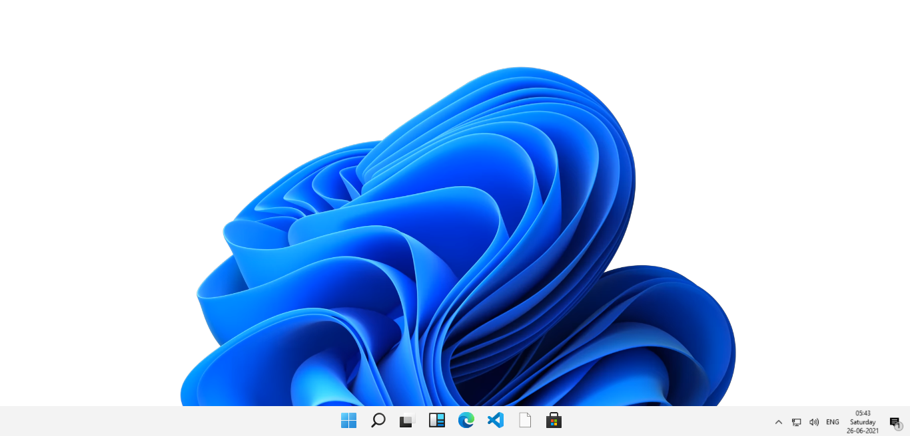
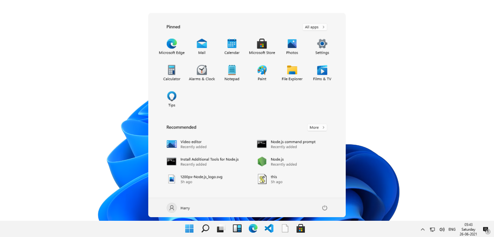

<p align="center">
<a href="https://github.com/ankityadavhere/win-11"></a>
<a href="https://github.com/ankityadavhere/win-11"></a>
<a href="https://github.com/ankityadavhere/win-11/blob/master/LICENSE"></a>
<a href="https://github.com/ankityadavhere/win-11/commits/master"></a>
<a href="https://github.com/ankityadavhere/win-11/stargazers"></a>
<a href="https://github.com/ankityadavhere/win-11/issues"></a>
<a href="https://github.com/ankityadavhere/win-11/network"></a>
<a href="https://twitter.com/intent/follow?screen_name=ankityadavhere"></a>
</p>

# Windows 11 home screen recreated with Pure HTML, CSS and vanilla Js

It's not complete UI but looks good enough ;)





## QuickStart

- Fork the repo

- Clone the repo into your local environment

- Open `index.html` with live server, it'll start at port `5500`

- Enter in browser

```bash
localhost:5500
```
